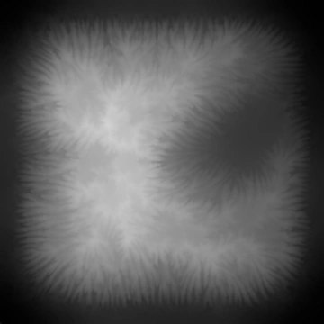
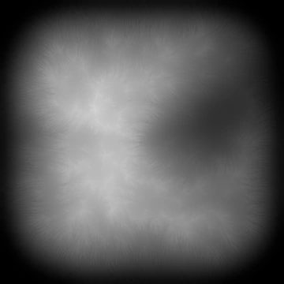
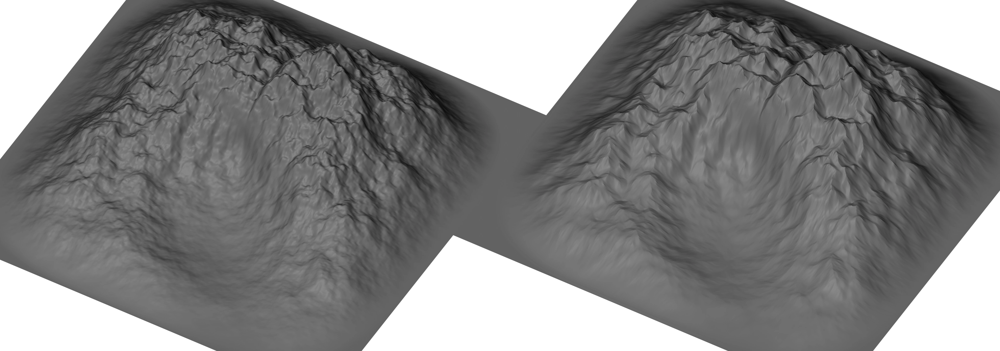
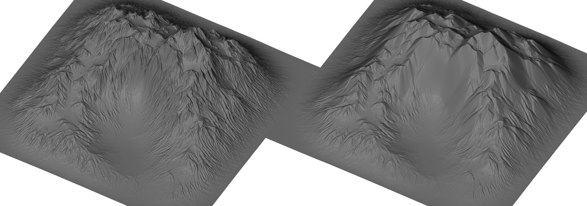
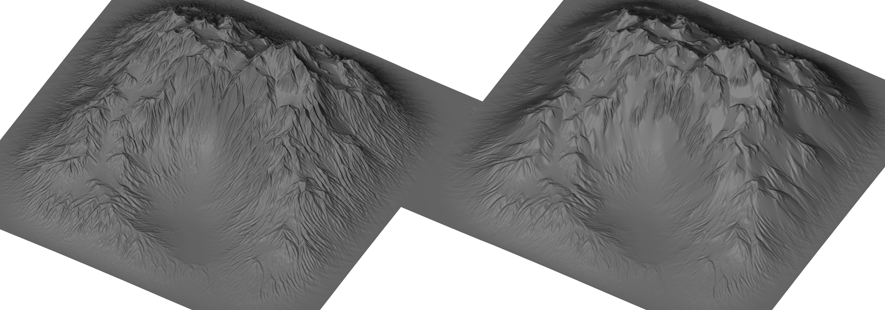
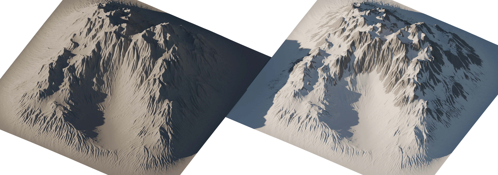

# Hydra - GPU Erosion in Blender

Setup guide
===========

To install this project, download the latest [Release](https://github.com/ozikazina/Hydra/releases) and import the **zip** file into Blender add-ons, then activate it.

This project requires external dependencies (~5 MB), which can be downloaded with a provided button in the preferences. Executing this command will probably require elevated privileges. If the installation fails, launch Blender as an administrator and try again. If it succeeds, restart the app normally.

The add-on page will indicate whether the dependencies are installed.

If you have the Fedora operating system, this add-on might not work because of this dependency.

Manual dependency installation or update
----------------------------

Go to your Blender installation directory and to the version you want to use. Then navigate to the `python\bin` directory. As an example for Windows:

`C:\Program Files\Blender Foundation\Blender {Version}\{Version}\python\bin`

Once there, open this folder in the command line and install ModernGL through the Python executable:

`python.exe -m pip install --upgrade moderngl`

or

`./python -m pip install --upgrade moderngl`

Uninstalling
------------

To uninstall the project, go to the add-ons tab and press remove. Removing the ModernGL library needs to be done manually.

Go to the Python folder specified above in the [Manual ModernGL installation](#manual-moderngl-installation) section and execute:

`python.exe -m pip uninstall moderngl`

or

`./python -m pip uninstall moderngl`

Add-on usage and principles
===========

This add-on supports erosion for individual **objects** and **images**. It can be found in the right side panel in **3D&nbsp;View** and **Image&nbsp;Editor** windows in the Hydra tab.

The add-on works by converting Blender objects and images into [internal heightmaps](#heightmaps). These heightmaps have the resolution of the original image or a chosen resolution for objects. Resolution can drastically change the size and shape of resulting features:

| | |
| :--: | :--: |
|  |  |
| **256x256 px** | **512x512 px** |
|||

- Once erosion starts, the resolution becomes locked. To pick a different resolution you first have to clear generated textures for the current object.

- If the height of the object changes (e.g. you apply Scale) or the resolution of the original image changes, then you should first clear existing heightmaps.

- Objects with overlapping geometry are supported, but the resulting heightmap might create unwanted deformations when applied back to the object.

Heightmaps
----------

The add-on creates two internal heightmaps - **Source** and **Result**.

- `Source` - Starting point for erosion.
- `Current` - Result of erosion. It is automatically previewed.

Choosing different parameters and eroding again will start erosion from the Source map, giving you the option to test different settings. To use the Result map as a starting point, use the **Set & Continue** button or the **Set as Source** button.

Applying results
----------------

The *Result* map can be applied in the following ways using buttons in the *Heightmaps* subtab:

| Object options | |
| --: | -- |
| `Modifier` | Adds a Displace modifier to the object. |
| `Bump` | Adds a bump map to the first material slot. Creates material if necessary.|
| `Displacement` | Adds a displacement map to the first material slot. Creates material if necessary.|
| `Mesh` | Applies modifiers to the mesh. Available if the preview or modifier option was chosen.|
| `Image` | Creates a Blender image of the heightmap.|

| Image options | |
| --: | -- |
| `Image` | Creates a new Blender image of the heightmap.|
| `To Original` | Writes the heightmap to the current image.|

Water erosion
=============

Parameters
----------

Water erosion has the following parameters:

| Parameter | Description |
| --: | -- |
| `Iterations` | Number of iterations to perform. |
| `Lifetime` | Number of steps a particle can take in an iteration. |
| `Acceleration` | Defines how strongly slopes affect particle movement. |
| `Drag` | Slows down particle movement. |
| `Erosion Smoothness` | Erosion strength. Slightly smoothes surface features. |
| `Deposition Strength` | Strength of sedimentation. |
| `Capacity` | Particle material capacity. Higher values lead to deeper features. |

| | |
| :--: | :--: |
|  |  |
| High acceleration | High capacity |
|  |  |
| Short lifetime | High smoothness |

Thermal erosion
===============

The add-on similarly supports thermal erosion, where steep surfaces cause material to slide down. It produces smooth slopes with a specified maximum angle.

Snow simulation
===============

Extras
=========

A special tab is offered for flow map generation and color transport.

Color transport
---------------

| | |
| :--: | :--: |
|  |  |
| **Particle** | **Pipe** |
|||

Flow maps
---------

The output texture stores flow concentration, which can be varied by a contrast slider.
Particle settings are shared with water erosion.

Heightmap generation
====================

Heightmaps can be generated directly at an arbitrary resolution. Cached heightmaps are also offered for direct export. This add-on creates the following types of heightmaps:
| | |
| --: | -- |
| `Normalized` | Heights are scaled to the range \[0,1\]. |
| `Proportional` | Vertical angles are preserved. |
| `Local size` | Equal to object height without scale applied. |
| `World size` | Equal to world height. |

License
=======

This project is released under the MIT license. It is also a Bachelor's thesis implementation for the Brno University of Technology, other limitations may therefore apply.